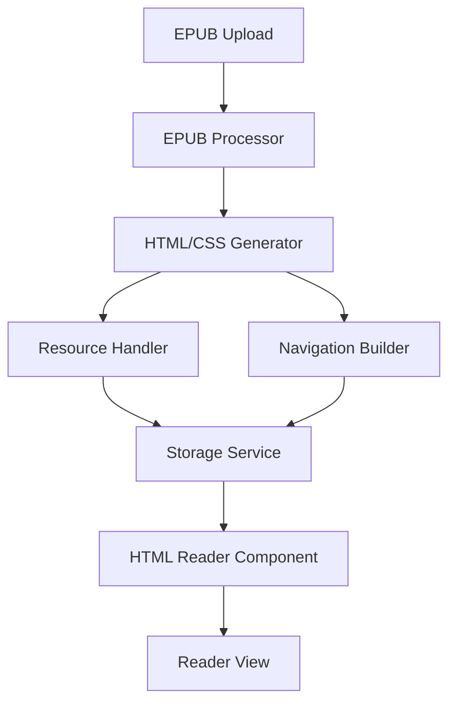

# EPUB to HTML Pre-Processor Development Plan

## Overview

This document outlines a revised approach for the ComfyReaderTempo EPUB reader implementation. Instead of parsing and rendering EPUB content in real-time, we'll pre-process EPUBs into standard HTML/CSS upon upload. This approach simplifies the reading experience while maintaining the core features users expect.

## Key Benefits

1. **Simplified Rendering**: Once converted to HTML/CSS, we can use standard web rendering capabilities
2. **Performance Improvement**: Processing happens once at upload time rather than every reading session
3. **Easier Customization**: Applying reading preferences to standard HTML/CSS is more straightforward
4. **Reduced Complexity**: No need for complex EPUB parsing during reading sessions
5. **Better Browser Compatibility**: Standard HTML/CSS is more predictably rendered across browsers

## Architecture



### Components Breakdown

1. **EPUB Processor**

   - Extracts ZIP contents
   - Parses container.xml, OPF, and NCX/Nav files
   - Creates a structured model of the EPUB content

2. **HTML/CSS Generator**

   - Converts EPUB chapters to standardized HTML
   - Normalizes and consolidates CSS
   - Ensures consistent styling across chapters

3. **Resource Handler**

   - Processes images and other assets
   - Creates appropriate file paths for resources
   - Optimizes resources as needed

4. **Navigation Builder**

   - Creates an HTML-based table of contents
   - Builds navigation controls
   - Sets up internal linking structure

5. **Storage Service**

   - Stores processed HTML/CSS and resources
   - Creates an index of book content
   - Manages access to stored content

6. **HTML Reader Component**
   - Displays pre-processed HTML content
   - Provides navigation and customization controls
   - Manages reading state and progress

## Implementation Plan

### Phase 1: EPUB Processor & HTML Generator

1. **EPUB Extraction & Parsing**

   - Extract the EPUB using JSZip
   - Parse the structure to identify chapters, TOC, metadata
   - Build a structured representation of the book

2. **HTML/CSS Generation**

   - Convert each EPUB chapter to standalone HTML
   - Normalize and consolidate CSS from the EPUB
   - Process and embed or link to fonts
   - Generate a single-page or multi-page HTML structure

3. **Resource Processing**

   - Extract and store images
   - Update resource references in HTML
   - Handle other media types (audio, video if present)

4. **Navigation Structure**

   - Create an HTML-based table of contents
   - Set up chapter navigation
   - Implement internal link resolution

5. **Storage Implementation**
   - Store processed HTML, CSS, and resources
   - Create an index file for the book
   - Implement efficient retrieval of book content

### Phase 2: HTML Reader Implementation

1. **Reader UI Component**

   - Create a component to display processed HTML content
   - Implement basic navigation controls
   - Display book metadata and cover

2. **Reading Experience**

   - Implement pagination or scrolling options
   - Add reading progress tracking
   - Create smooth transitions between chapters

3. **Customization Features**

   - Add font size and family controls
   - Implement theming options (light, dark, sepia)
   - Add margin and line spacing adjustments

4. **Advanced Features**
   - Bookmarking functionality
   - Reading history
   - Last position memory

### Phase 3: Performance Optimizations

1. **Resource Management**

   - [x] Implement lazy loading for large books
   - [x] Add chapter preloading for faster navigation
   - [x] Create memory management for resource cleanup
   - [x] Implement efficient chapter caching

2. **Search & Navigation**

   - [x] Create full-text search functionality
   - [x] Implement search results navigation
   - [x] Add search term highlighting
   - [x] Build efficient search indexing

3. **Reader Experience Enhancements**

   - [x] Add smooth scrolling and animations
   - [x] Implement gesture-based navigation
   - [x] Create dynamic layout adjustments
   - [x] Add accessibility features

## Implementation Progress Summary

We have successfully completed all tasks from Phase 1 through Phase 3 of our EPUB to HTML pre-processor implementation plan:

### Completed Features:

1. **Core Functionality (Phase 1)**

   - Implemented EPUB extraction and structure parsing
   - Created HTML and CSS generation from EPUB content
   - Developed resource processing for images and other assets
   - Built navigation structure with table of contents
   - Implemented storage service for processed content

2. **Reader UI (Phase 2)**

   - Created the HTML reader component with advanced navigation controls
   - Implemented reading progress tracking and chapter transitions
   - Added customization features (font size, theme, margins, etc.)
   - Built advanced features including bookmarking, reading history, and position memory

3. **Performance Optimization (Phase 3)**
   - Implemented lazy loading for large books with efficient chapter caching
   - Added chapter preloading for faster navigation experience
   - Created memory management to avoid resource leaks
   - Built full-text search with result highlighting and navigation
   - Implemented smooth scrolling and page transition animations
   - Added touch gestures for natural navigation on mobile devices
   - Implemented responsive layouts and accessibility features

### Next Steps:

We are now ready to proceed to Phase 4, which focuses on integration and testing:

### Phase 4: Integration and Testing

### Implementation Checklist

#### Unit Testing

- [x] Set up testing framework (Jest)
- [x] Create test fixtures and mocks
- [x] Test EPUB processing functions
- [x] Test HTML/CSS generation
- [x] Test storage service
- [x] Test resource handling
- [x] Test navigation building

#### Integration Testing

- [ ] End-to-end tests for processing and rendering
- [ ] Test navigation and TOC functionality
- [ ] Test customization features with sample EPUB files

#### Performance Testing

- [ ] Measure processing speed for various book sizes
- [ ] Measure memory usage during reading
- [ ] Measure loading times for processed books
- [ ] Benchmark against direct EPUB rendering

## Considerations and Trade-offs

### Advantages

1. **Simplified Reading Experience**: No need for complex EPUB parsing during reading
2. **Better Performance**: Pre-processed content loads faster
3. **More Reliable Rendering**: Standard HTML/CSS is more predictably rendered
4. **Easier to Implement**: Fewer edge cases to handle during reading
5. **Better Customization**: Easier to apply user preferences to standard HTML

### Challenges

1. **Storage Requirements**: Need to store both original EPUB and processed HTML
2. **Processing Time**: Initial delay when a book is first added
3. **Large Books**: Very large books might create processing challenges
4. **Complex Formatting**: Some advanced EPUB features might be difficult to preserve

## Integration with ComfyReaderTempo

To integrate the EPUB-to-HTML processor with the existing ComfyReaderTempo application:

1. Create a processing service that runs when books are added to the library
2. Store processed HTML and resources in the application's storage system
3. Replace the current BasicEpubReader.tsx with the new HTML-based reader
4. Ensure compatibility with the application's existing features and UI

## Detailed Implementation in ComfyReaderTempo Context

### Application Integration Analysis

Before implementing the EPUB-to-HTML pre-processor, we need to understand how it fits into the existing application architecture:

1. **Current EPUB Handling**:

   - Analyze `BasicEpubReader.tsx` to understand the current implementation
   - Identify how EPUBs are currently loaded, parsed, and displayed
   - Determine which components rely on the current reader implementation

2. **Storage System**:

   - Examine how books are currently stored in the application
   - Identify the storage mechanisms (IndexedDB, localStorage, etc.)
   - Determine how to extend this to include processed HTML and resources

3. **UI Integration Points**:
   - Review the application's UI components where the reader is displayed
   - Identify customization controls that need to be connected to the new reader
   - Determine how navigation and progress tracking are currently implemented

### Implementation Steps

#### 1. Create the EPUB Processor Service

Create a new service module in the application structure:

```typescript
// Example location: src/services/epubProcessor.ts

import JSZip from "jszip";
// Other imports...

export async function processEpubToHtml(
  epubFile: File
): Promise<ProcessedBook> {
  // Implementation based on the technical details outlined earlier
}

export async function storeProcessedBook(book: ProcessedBook): Promise<string> {
  // Store the processed book in the application's storage system
  // Return an identifier for the processed book
}
```

#### 2. Add Processing Step to Book Import Flow

Locate the current book import functionality and add the processing step:

```typescript
// Example modification to existing code

// Before:
async function importBook(file: File) {
  // Current import logic...
  addBookToLibrary(book);
}

// After:
async function importBook(file: File) {
  // Current import logic...

  // Add processing step
  const processedBook = await processEpubToHtml(file);
  const processedBookId = await storeProcessedBook(processedBook);

  // Associate processed book with original
  addBookToLibrary({
    ...book,
    processedBookId,
  });
}
```

#### 3. Create the HTML-Based Reader Component

Create a new reader component that displays the processed HTML:

```typescript
// Example location: src/components/HtmlBookReader.tsx

import React, { useEffect, useState } from "react";
// Other imports...

interface HtmlBookReaderProps {
  bookId: string;
  onProgressUpdate?: (progress: number) => void;
  // Other props...
}

export function HtmlBookReader({
  bookId,
  onProgressUpdate,
  ...props
}: HtmlBookReaderProps) {
  const [bookContent, setBookContent] = useState<ProcessedBook | null>(null);
  const [currentChapter, setCurrentChapter] = useState<number>(0);
  // Other state...

  useEffect(() => {
    // Load the processed book content from storage
    loadProcessedBook(bookId).then(setBookContent);
  }, [bookId]);

  // Implement navigation, customization, and other reader features

  return (
    <div className="html-book-reader">{/* Reader UI implementation */}</div>
  );
}
```

#### 4. Replace BasicEpubReader with the New Reader

Modify the application to use the new reader component:

```typescript
// Example modifications to existing code

// Before:
import { BasicEpubReader } from "./components/BasicEpubReader";

function ReaderView({ book }) {
  return <BasicEpubReader book={book} />;
}

// After:
import { HtmlBookReader } from "./components/HtmlBookReader";

function ReaderView({ book }) {
  return <HtmlBookReader bookId={book.processedBookId || book.id} />;
}
```

#### 5. Implement Storage Service for Processed Content

Create a storage service specifically for the processed HTML and resources:

```typescript
// Example location: src/services/processedBookStorage.ts

export async function storeProcessedBook(book: ProcessedBook): Promise<string> {
  // Implementation depends on the current storage mechanism
  // Could use IndexedDB, localStorage, or a server-based storage
}

export async function loadProcessedBook(
  bookId: string
): Promise<ProcessedBook> {
  // Load the processed book from storage
}

export async function getChapterContent(
  bookId: string,
  chapterId: string
): Promise<string> {
  // Get the HTML content for a specific chapter
}

export async function getResource(
  bookId: string,
  resourcePath: string
): Promise<Blob> {
  // Get a specific resource (image, CSS, etc.)
}
```

#### 6. Connect Reader Customization Features

Ensure customization features are connected to the new reader:

```typescript
// Example customization implementation

function applyReadingPreferences(
  contentElement: HTMLElement,
  preferences: ReadingPreferences
) {
  // Apply font size, theme, margins, etc.
  contentElement.style.fontSize = `${preferences.fontSize}px`;
  // Apply other preferences...
}
```

#### 7. Implement Progressive Enhancement

Handle cases where processed content is not yet available:

```typescript
function ReaderView({ book }) {
  const [isProcessed, setIsProcessed] = useState<boolean>(false);

  useEffect(() => {
    // Check if the book has been processed
    checkBookProcessingStatus(book.id).then(setIsProcessed);
  }, [book.id]);

  if (!isProcessed) {
    // Show loading state or fallback to basic reader
    return <ProcessingIndicator book={book} />;
  }

  return <HtmlBookReader bookId={book.processedBookId || book.id} />;
}
```

### Migration Strategy

To ensure a smooth transition from the current EPUB reader to the new HTML-based reader:

1. **Parallel Implementation**:

   - Initially implement the new reader alongside the existing one
   - Add a feature flag or user preference to switch between them
   - This allows for testing and comparison

2. **Phased Rollout**:

   - First implement the EPUB processing service
   - Then add the HTML reader as an alternative reading mode
   - Gradually move users to the new reader

3. **Background Processing**:
   - Implement a background job to process existing EPUBs in the library
   - Show processing status in the UI for transparency
   - Prioritize books based on user activity

### Testing in Application Context

1. **Integration Testing**:

   - Test the integration points between the processor and existing code
   - Verify that book import flow works correctly with processing
   - Ensure reading progress is correctly tracked and persisted

2. **Performance Testing**:

   - Measure the time to process EPUBs of various sizes
   - Test the reader performance with large books
   - Compare memory usage between the old and new implementations

3. **User Experience Testing**:
   - Test the reader with various customization settings
   - Verify that navigation and bookmarking work correctly
   - Ensure accessibility features are properly implemented

### Fallback and Error Handling

1. **Processing Failures**:

   - Implement error handling for EPUB processing failures
   - Provide a fallback to the original reader if processing fails
   - Add retry mechanisms for failed processing attempts

2. **Missing Resources**:

   - Handle cases where resources like images might be missing
   - Implement placeholders for unavailable resources
   - Log and report resource loading failures

3. **Storage Limitations**:
   - Consider device storage limitations for processed content
   - Implement cleanup strategies for unused processed content
   - Add warnings for very large books that might be problematic

### Continuous Improvement

1. **Usage Analytics**:

   - Add analytics to track reader performance and usage
   - Identify common issues or pain points
   - Use data to prioritize further improvements

2. **Feedback Mechanism**:

   - Add a way for users to report issues with specific books
   - Collect information about problematic EPUBs
   - Create a process for addressing common formatting issues

3. **Optimization Cycles**:
   - Plan for periodic optimization of the processing algorithm
   - Identify opportunities to improve HTML/CSS generation
   - Continuously refine the reading experience based on feedback

By following this detailed integration plan, the EPUB-to-HTML pre-processor can be seamlessly incorporated into the ComfyReaderTempo application, providing users with an improved reading experience while maintaining compatibility with the existing codebase and features.

## Conclusion

This pre-processing approach offers a more efficient path to creating a reliable EPUB reading experience. By converting EPUBs to standard HTML/CSS at upload time, we can focus on delivering a high-quality reading interface without the complexity of real-time EPUB parsing and rendering.

The implementation can be completed in phases, with each phase building on the previous one. This approach also allows for early testing and validation of the core functionality before moving on to more advanced features.

By focusing on the pre-processing strategy, we can deliver a lightweight yet reliable EPUB reader that provides an excellent user experience while being easier to maintain and extend in the future.
