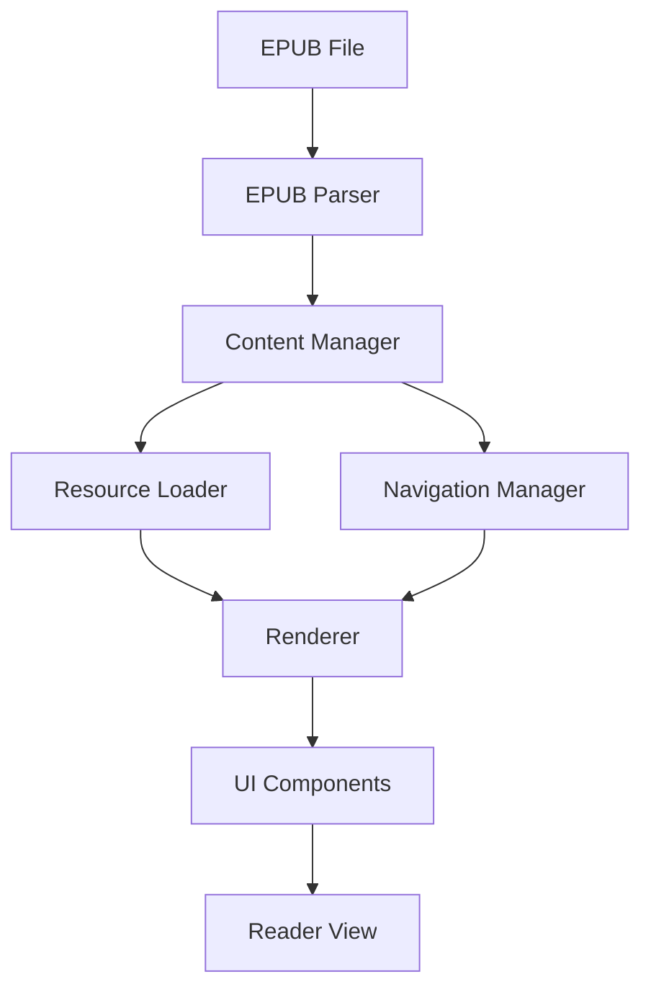

# EPUB Renderer Development Plan

## Overview

This document outlines a comprehensive plan for building an EPUB renderer from scratch for the ComfyReaderTempo application. The renderer will handle EPUB parsing, content rendering, navigation, and styling while supporting core EPUB features like table of contents, pagination, and responsive design.

## Requirements

### Core Functionality

- Parse EPUB file structure (ZIP-based container)
- Extract and process metadata from OPF files
- Render XHTML content with appropriate styling
- Support navigation between chapters
- Display table of contents
- Handle internal hyperlinks
- Support pagination and continuous scrolling modes
- Lazy-load images and resources for performance
- Support both EPUB2 and EPUB3 standards

### User Experience

- Responsive design for various screen sizes
- Customizable reading experience (font size, theme, etc.)
- Smooth page transitions
- Reading progress tracking
- Support for bookmarks and annotations
- Proper handling of fixed-layout EPUBs
- Support for dark mode reading

### Technical Requirements

- Built with React and TypeScript
- Component-based architecture
- Efficient resource management
- Error handling and fallbacks
- Accessibility compliance
- Minimal external dependencies

## Architecture



### Components Breakdown

1. **EPUB Parser**

   - Extracts ZIP contents
   - Parses container.xml, OPF, and NCX/Nav files
   - Creates an in-memory model of the EPUB structure

2. **Content Manager**

   - Manages book metadata
   - Manages chapter content
   - Handles content transformations and processing

3. **Resource Loader**

   - Loads images, CSS, and other assets
   - Implements lazy loading
   - Handles resource caching

4. **Navigation Manager**

   - Manages TOC and spine navigation
   - Handles internal link resolution
   - Tracks reading progress

5. **Renderer**

   - Renders HTML content safely
   - Applies styling
   - Handles pagination logic

6. **UI Components**
   - Navigation controls
   - TOC display
   - Settings interface
   - Pagination controls

## Implementation Plan

### Phase 1: Core Parser and Basic Renderer

1. **Set up project structure**

   - Create component hierarchy
   - Set up TypeScript interfaces
   - Configure build tools

2. **Implement EPUB parsing**

   - Extract ZIP content using JSZip
   - Parse container.xml to find content.opf
   - Extract metadata, manifest, and spine
   - Build TOC from NCX or nav document

3. **Create basic content renderer**

   - Render single chapter content
   - Handle basic content sanitization
   - Process relative URLs

4. **Implement basic navigation**
   - Previous/next chapter controls
   - TOC navigation

### Phase 2: Advanced Features and UI Refinement

1. **Enhance content processing**

   - CSS handling and style injection
   - Image processing and lazy loading
   - Font embedding support

2. **Implement pagination**

   - Virtualized page rendering
   - Page transition animations
   - Current position tracking

3. **Add reading customization**

   - Font size controls
   - Theme switching (including dark mode)
   - Layout options (single page, two-page, etc.)

4. **Improve navigation**
   - Internal link handling
   - Bookmarks functionality
   - Reading progress persistence

### Phase 3: Performance and Edge Cases

1. **Optimize performance**

   - Resource caching strategies
   - Render optimization
   - Memory management

2. **Handle edge cases**

   - Malformed EPUB files
   - Fixed-layout EPUBs
   - Various EPUB standards compatibility

3. **Accessibility improvements**

   - Keyboard navigation
   - Screen reader compatibility
   - High contrast mode

4. **Add advanced features**
   - Text selection and highlights
   - Notes and annotations
   - Search functionality

## Key Implementation Details

### EPUB Parsing

```typescript
interface EpubMetadata {
  title: string;
  creator: string;
  language: string;
  publisher: string;
  identifier: string;
}

interface SpineItem {
  id: string;
  href: string;
  mediaType: string;
  linear: boolean;
  index: number;
}

interface TocItem {
  title: string;
  href: string;
  index: number;
  level: number;
  children: TocItem[];
}

// Parse container.xml to find content.opf
async function parseContainerXml(zip: JSZip): Promise<string> {
  const containerXml = await zip.file("META-INF/container.xml").async("text");
  const parser = new DOMParser();
  const containerDoc = parser.parseFromString(containerXml, "application/xml");
  return containerDoc.querySelector("rootfile").getAttribute("full-path");
}

// Parse content.opf for metadata, manifest, and spine
async function parseContentOpf(
  zip: JSZip,
  opfPath: string
): Promise<{
  metadata: EpubMetadata;
  spine: SpineItem[];
}> {
  // Implementation details...
}

// Parse TOC (NCX or nav document)
async function parseToc(
  zip: JSZip,
  contentDoc: Document,
  manifest: Record<string, any>,
  basePath: string,
  spine: SpineItem[]
): Promise<TocItem[]> {
  // Implementation details...
}
```

### Resource Handling

```typescript
// Resolve relative URLs
function resolveHref(href: string, base: string): string {
  if (!href) return "";

  // Handle absolute paths
  if (href.startsWith("/")) {
    return href.substring(1);
  }

  // Handle relative paths
  return base + href;
}

// Process chapter content
async function processChapterContent(
  doc: Document,
  chapterPath: string,
  book: JSZip
): Promise<Document> {
  const chapterDir = chapterPath.substring(0, chapterPath.lastIndexOf("/") + 1);

  // Process images
  const images = doc.querySelectorAll("img");
  for (const img of images) {
    // Implementation details...
  }

  // Process stylesheets
  const links = doc.querySelectorAll("link[rel='stylesheet']");
  for (const link of links) {
    // Implementation details...
  }

  // Process internal links
  const anchors = doc.querySelectorAll("a[href]");
  for (const anchor of anchors) {
    // Implementation details...
  }

  return doc;
}
```

### Reading Experience

```typescript
interface ReadingOptions {
  fontSize: number;
  fontFamily: string;
  lineHeight: number;
  theme: "light" | "dark" | "sepia";
  pageMode: "paginated" | "scrolled";
  margins: number;
}

// Apply reading options to content
function applyReadingOptions(
  contentElement: HTMLElement,
  options: ReadingOptions
): void {
  contentElement.style.fontSize = `${options.fontSize}px`;
  contentElement.style.fontFamily = options.fontFamily;
  contentElement.style.lineHeight = options.lineHeight.toString();

  // Apply theme
  if (options.theme === "dark") {
    contentElement.closest(".epub-reader")?.classList.add("dark-mode");
  } else {
    contentElement.closest(".epub-reader")?.classList.remove("dark-mode");
  }

  // Apply page mode
  if (options.pageMode === "paginated") {
    contentElement.closest(".epub-reader")?.classList.add("paginated");
  } else {
    contentElement.closest(".epub-reader")?.classList.remove("paginated");
  }

  // Apply margins
  contentElement.style.padding = `24px ${options.margins}px`;
}
```

### Pagination Logic

```typescript
// Calculate pagination
function calculatePagination(contentElement: HTMLElement): number {
  const contentHeight = contentElement.scrollHeight;
  const viewportHeight = contentElement.clientHeight;
  const pages = Math.ceil(contentHeight / viewportHeight);

  return pages > 0 ? pages : 1;
}

// Navigate to a specific page
function goToPage(
  contentElement: HTMLElement,
  page: number,
  totalPages: number
): number {
  const newPage = Math.max(1, Math.min(page, totalPages));
  const viewportHeight = contentElement.clientHeight;

  contentElement.scrollTop = (newPage - 1) * viewportHeight;
  return newPage;
}
```

## Styling Guidelines

The EPUB renderer should follow these styling guidelines to ensure a consistent and pleasant reading experience:

1. **Container Styling**

   - Clean, minimalist design
   - Proper spacing and margins
   - Subtle shadows and borders

2. **Content Styling**

   - Readable typography (font-size, line-height, etc.)
   - Proper handling of embedded styles
   - Image scaling and alignment

3. **Controls and UI**

   - Intuitive navigation buttons
   - Unobtrusive UI elements
   - Clear visual feedback

4. **Responsive Design**

   - Adapt to different screen sizes
   - Support both portrait and landscape orientations
   - Adjust layout for mobile devices

5. **Accessibility**
   - High contrast options
   - Keyboard navigation support
   - Screen reader compatibility

## Integration with ComfyReaderTempo

To integrate the EPUB renderer with the existing ComfyReaderTempo application:

1. Create a new `EpubRenderer` component that utilizes the modules described above
2. Integrate with the application's document handling system
3. Connect to the application's storage and progress tracking features
4. Ensure compatibility with the application's UI theme and styles
5. Add appropriate event hooks for analytics and usage tracking

## Testing Strategy

The EPUB renderer should be thoroughly tested to ensure reliability:

1. **Unit Tests**

   - Test individual parsing functions
   - Test URL resolution and content processing
   - Test pagination and navigation logic

2. **Integration Tests**

   - Test end-to-end EPUB loading and rendering
   - Test navigation between chapters
   - Test TOC functionality

3. **Sample EPUBs**

   - Create a test suite with various EPUB files
   - Include both EPUB2 and EPUB3 examples
   - Include edge cases (fixed layout, complex formatting)

4. **Cross-browser Testing**
   - Ensure compatibility with modern browsers
   - Test on different devices and screen sizes

## Implementation Checklist

### Phase 1: Core Parser and Basic Renderer

#### Project Setup

- [ ] Create component directory structure for the renderer
- [ ] Set up TypeScript interfaces for EPUB components
- [ ] Configure any necessary build tools
- [ ] Create initial EpubRenderer component

#### EPUB Parsing

- [ ] Implement ZIP extraction functionality using JSZip
- [ ] Create parser for container.xml to locate content.opf
- [ ] Build parser for content.opf to extract:
  - [ ] Metadata (title, author, etc.)
  - [ ] Manifest (resources list)
  - [ ] Spine (reading order)
- [ ] Implement TOC parser for NCX or nav documents
- [ ] Create data model for the parsed EPUB structure

#### Basic Content Renderer

- [ ] Create component to render a single chapter's content
- [ ] Implement HTML content sanitization for security
- [ ] Process and resolve relative URLs for resources
- [ ] Handle basic styling of content
- [ ] Render images found in content

#### Basic Navigation

- [ ] Implement previous/next chapter navigation controls
- [ ] Create simple TOC component for navigation
- [ ] Add chapter position tracking

### Phase 2: Advanced Features and UI Refinement

#### Enhanced Content Processing

- [ ] Implement CSS handling and style injection
- [ ] Add support for image processing and lazy loading
- [ ] Implement font embedding support
- [ ] Handle internal content transformations

#### Pagination Implementation

- [ ] Create virtualized page rendering
- [ ] Implement page transition animations
- [ ] Build reading position tracking system
- [ ] Support both pagination and continuous scrolling modes

#### Reading Customization

- [ ] Add font size controls
- [ ] Implement theme switching (light, dark, sepia)
- [ ] Create layout option controls (margins, line height, etc.)
- [ ] Add font family selection

#### Improved Navigation

- [ ] Handle internal hyperlinks properly
- [ ] Implement bookmarks functionality
- [ ] Create reading progress persistence
- [ ] Add history navigation

### Phase 3: Performance and Edge Cases

#### Performance Optimization

- [ ] Implement resource caching strategies
- [ ] Optimize rendering performance
- [ ] Add proper memory management
- [ ] Implement lazy loading for chapters

#### Edge Case Handling

- [ ] Add support for malformed EPUB files
- [ ] Implement handling for fixed-layout EPUBs
- [ ] Ensure compatibility with both EPUB2 and EPUB3 standards
- [ ] Add fallbacks for missing resources

#### Accessibility Improvements

- [ ] Implement keyboard navigation
- [ ] Ensure screen reader compatibility
- [ ] Add high contrast mode
- [ ] Make controls accessible

#### Integration with ComfyReaderTempo

- [ ] Connect with the application's document handling system
- [ ] Integrate with storage and progress tracking features
- [ ] Ensure compatibility with application's UI theme and styles
- [ ] Add appropriate event hooks for analytics

### Testing

#### Unit Testing

- [ ] Create tests for parsing functions
- [ ] Test URL resolution and content processing
- [ ] Test pagination and navigation logic

#### Integration Testing

- [ ] Test end-to-end EPUB loading and rendering
- [ ] Test navigation between chapters
- [ ] Test TOC functionality
- [ ] Test with sample EPUB files (both EPUB2 and EPUB3)

#### Compatibility Testing

- [ ] Test on different browsers
- [ ] Test on different screen sizes
- [ ] Test performance with large EPUB files

## Future Enhancements

Future iterations of the EPUB renderer could include:

1. **Advanced typography features**

   - Custom fonts and line spacing
   - Column layout options
   - Text justification controls

2. **Social features**

   - Shared annotations
   - Reading groups
   - Social recommendations

3. **Advanced navigation**

   - Full-text search
   - Content filtering
   - Advanced bookmarking

4. **Accessibility enhancements**

   - Text-to-speech integration
   - Enhanced keyboard navigation
   - High contrast themes

5. **Performance optimizations**
   - Web Worker processing
   - IndexedDB caching
   - Virtual rendering for large documents

## Conclusion

This plan outlines a comprehensive approach to building an EPUB renderer from scratch. By following the phased implementation plan and adhering to the architectural guidelines, we can create a robust, performant, and feature-rich EPUB reading experience that integrates seamlessly with the ComfyReaderTempo application.

The focus should be on creating a renderer that not only handles the technical aspects of EPUB parsing and rendering but also provides an exceptional reading experience that adapts to user preferences and device capabilities.
